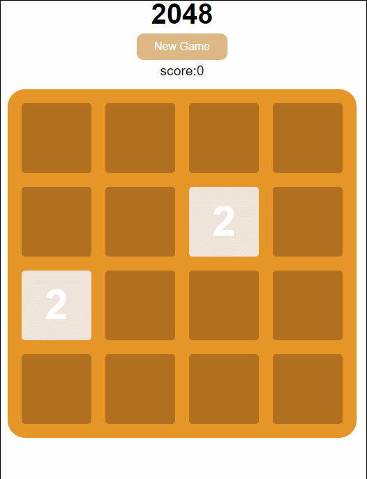

#2048

一个2048小游戏，采用原生js—+jquery动画用jquery制作

demo：[2048小游戏](http://htmlpreview.github.io/?https://github.com/Taniffer/Taniffer.github.io/blob/master/2048/index.html)

##支持：
- 有⼀个简单的步骤累计计分， 能判断游戏胜负（达成2048获胜， 格⼦填满未达成2048失败）
- 实现键盘上下左右操控
- 实现游戏动画效果
- 实现响应式布局， 模拟⼿机触摸操作

